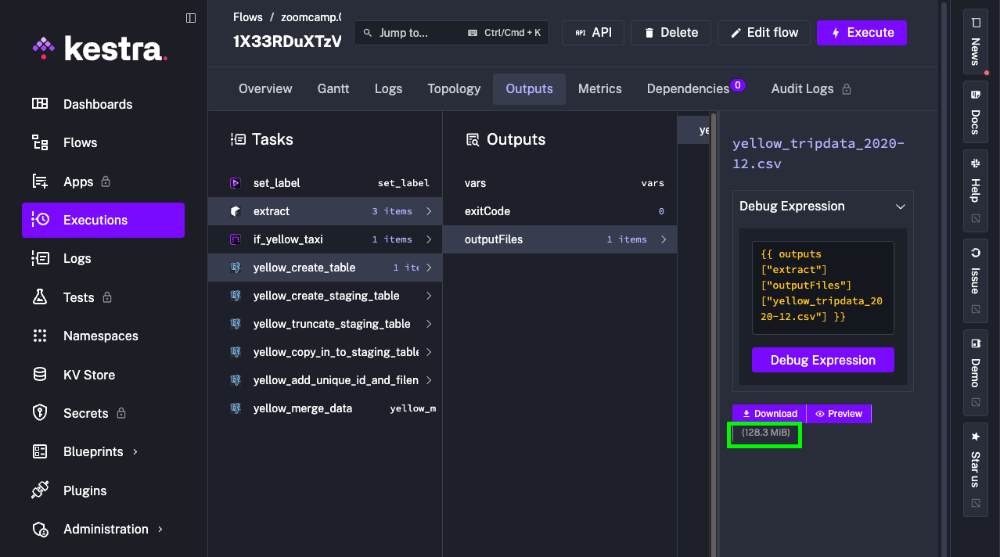
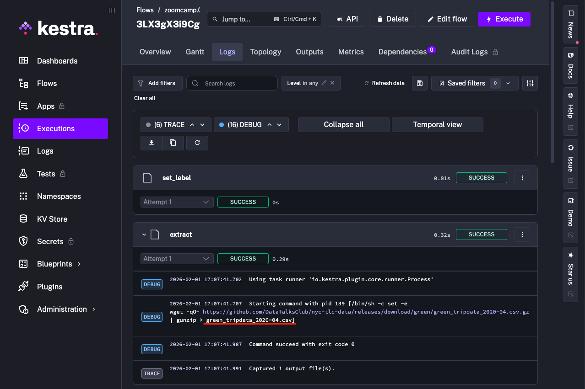
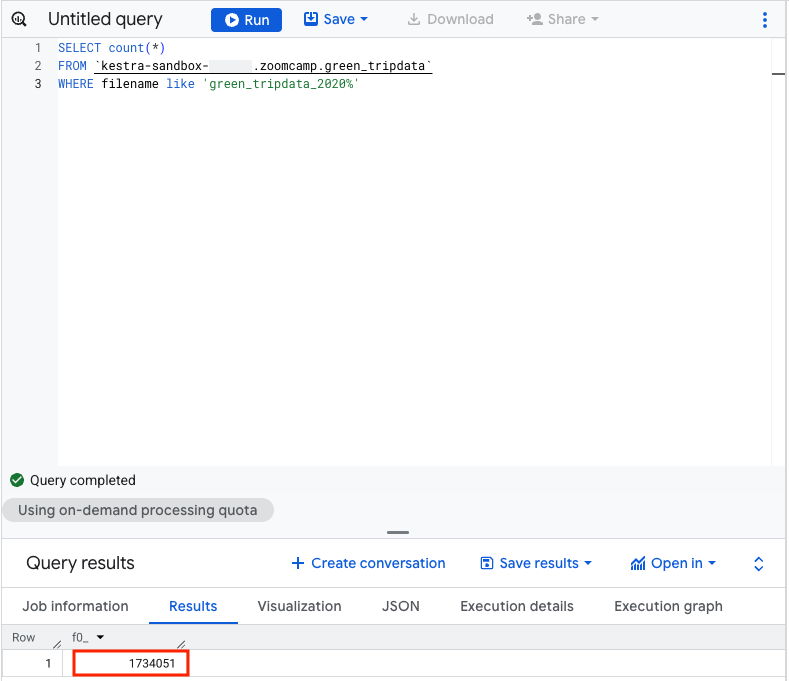
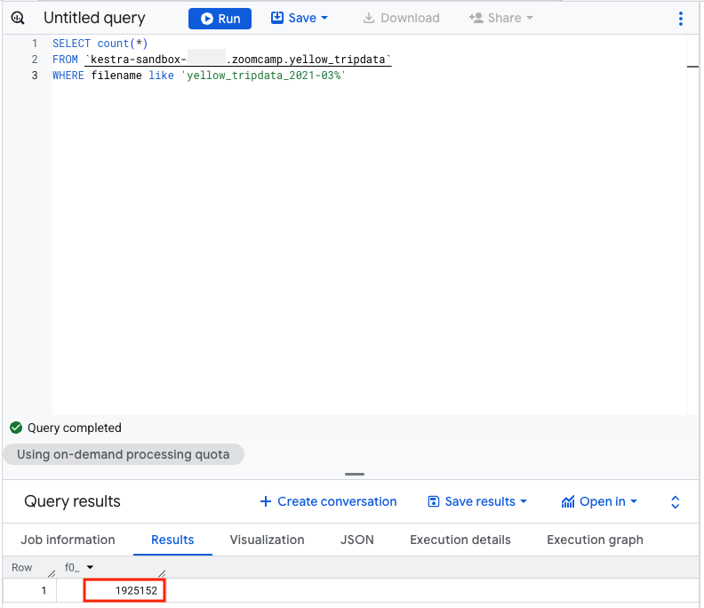
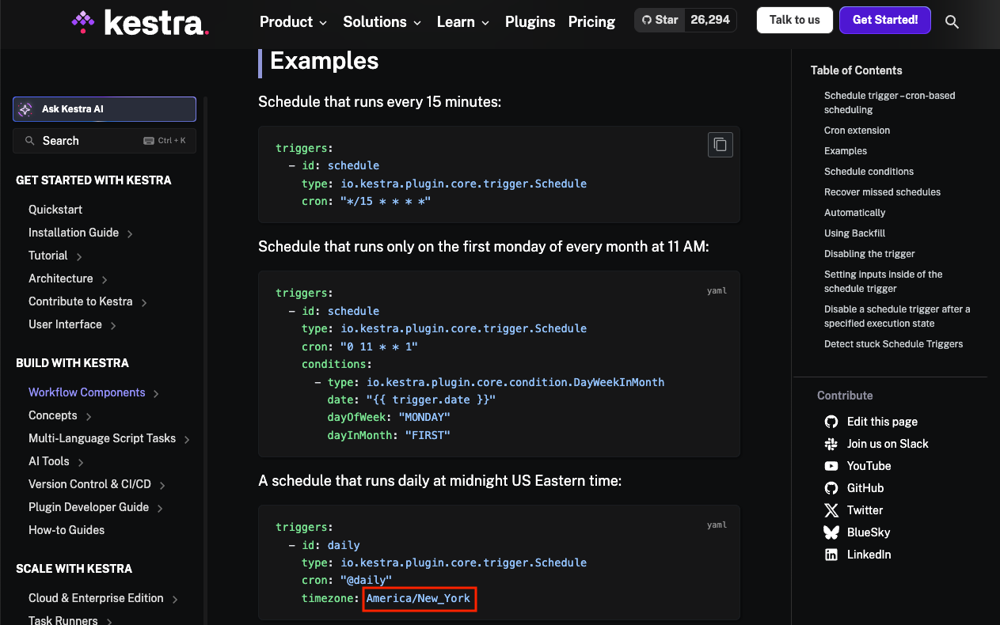

## Module 2 Homework

### Quiz Questions

Complete the quiz shown below. It's a set of 6 multiple-choice questions to test your understanding of workflow orchestration, Kestra, and ETL pipelines.

1) Within the execution for `Yellow` Taxi data for the year `2020` and month `12`: what is the uncompressed file size (i.e. the output file `yellow_tripdata_2020-12.csv` of the `extract` task)?

- **Answer: 128.3 MiB**

2) What is the rendered value of the variable `file` when the inputs `taxi` is set to `green`, `year` is set to `2020`, and `month` is set to `04` during execution?

- **Answer: green_tripdata_2020-04.csv**

3) How many rows are there for the `Yellow` Taxi data for all CSV files in the year 2020?

- **Answer: 24,648,499**

4) How many rows are there for the `Green` Taxi data for all CSV files in the year 2020?

- **Answer: 1,734,051**

5) How many rows are there for the `Yellow` Taxi data for the March 2021 CSV file?

- **Answer: 1,925,152**

6) How would you configure the timezone to New York in a Schedule trigger?

- **Answer: America/New_York**

